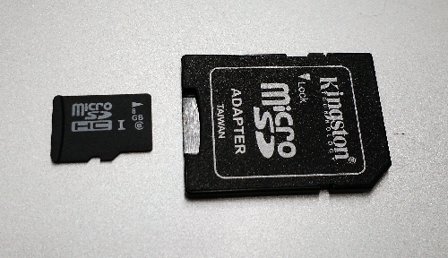
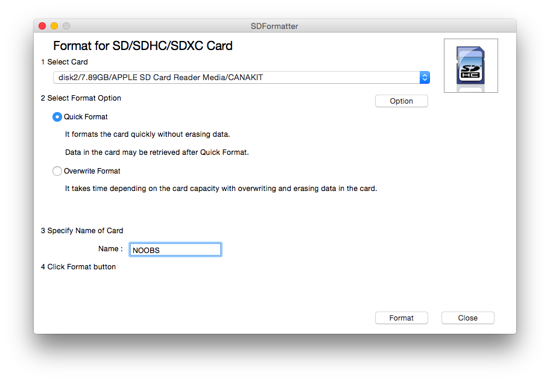
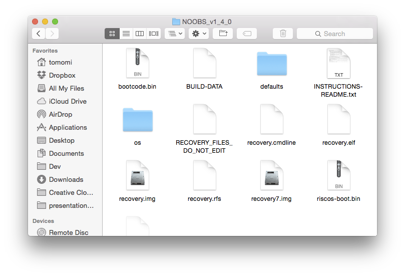
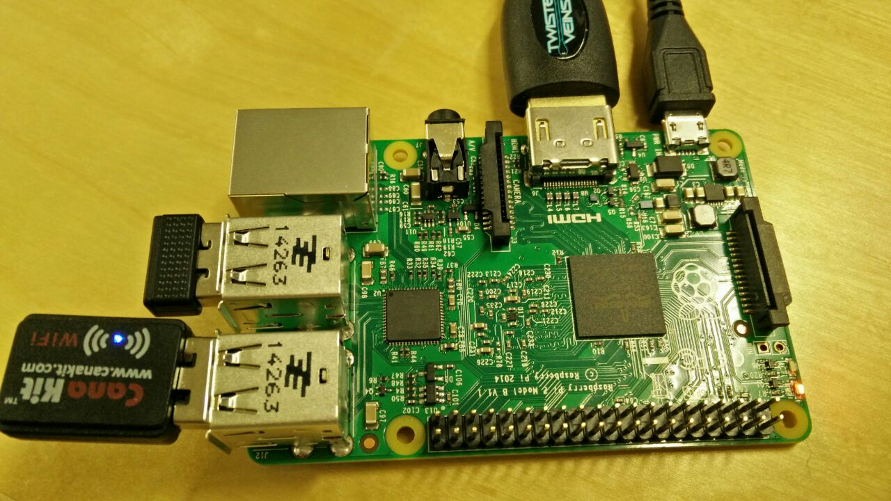
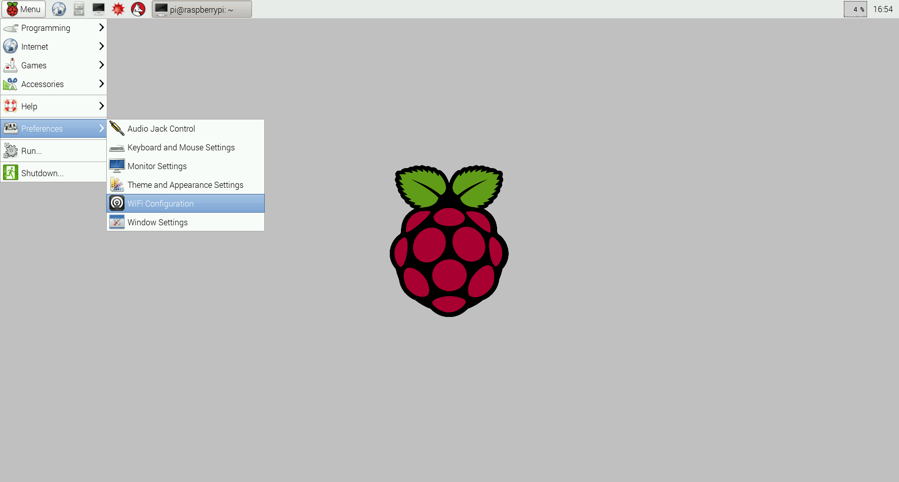

# IoT Hands On: Build a Realtime App with Raspberry Pi 2 and PubNub

Step-by-step guide of building a realtime Internet of Things application using sensor data from Raspberry Pi 2. Just released, this hardware makes it quick and easy to build and deploy internet-enabled sensors. You'll also learn how to aggregate that sensor data and display it with realtime updates over the PubNub network.

---

For Workshop attendees, please fill this out after the session. Thank you :-)

[**Feedback form** (https://goo.gl/0WeZQb)](https://docs.google.com/a/pubnub.com/forms/d/1IClKgCneGgiPH62GHrc4z6fbk7OyFZ-X2YbyEdaPxp8/edit?ts=56b8f8f7)

The workshop slide deck is available at:
[https://docs.google.com/presentation/d/1kHjN8CIbggBlr44m2JpsRpR6IHB-Yu7b5bECC-_ntK4/edit?usp=sharing](https://docs.google.com/presentation/d/1kHjN8CIbggBlr44m2JpsRpR6IHB-Yu7b5bECC-_ntK4/edit?usp=sharing)

---

## Setting up Raspberry Pi

Skip the Step 0 and go to Step 1, if you have a preloaded SD Card from CanaKit or elsewhere.

### 0. Formatting an SD Card

The following steps are done on your computer.

1. Download [SD Formatter 4.0](https://www.sdcard.org/downloads/formatter_4) and install on your computer.
2. Insert it in SD card reader in the computer. If you need, use a Micro SD adapter (photo).

3. Run the SD Card Formatter.

4. Download the **Noobs** zip file from [raspberrypi.org](http://www.raspberrypi.org/downloads/) and extract to a desired location.
5. Open up the SD card drive, and drag-drop the unzipped **Noobs** contents (not the entire folder!) you just downloaded, into the SD card. Then eject the SD card.


### 1. Installing Raspbian on Raspberry Pi

From now on you are working directly on your Raspberry Pi.

1. Insert the formatted SD card in Pi.
2. Plug in your USB keyboard, USB mouse, and HDMI monitor cables.
3. Plug in your Wi-Fi adapter.
4. Plug a USB power, and turn your Pi on.



After connecting to a monitor:

1. Your Raspberry Pi will boot, and a window will appear with a list of operating systems that you can install. Select **Raspbian** by ticking the box next to Raspbian and click on Install.
2. Raspbian will run through its installation process. Just wait. This takes a while.
3. When the install process has completed, the Raspberry Pi configuration menu (raspi-config) will load. You can exit this menu by using Tab on your keyboard to move to Finish.

### 2. Starting Raspbian

The default login for Raspbian is username *pi* with the password *raspberry*.

When you see a prompt, start the GUI.

`pi@raspberrypi ~$ startx`

*If you get the following message, ignore it for now:
GDBus.Error:org.freedesktop.PolicyKit1.Error.Failed: Cannot determine user of subject*

### 3. Configuring Wi-Fi

Go to **Menu** > **Preference** > **WiFi Configuration**



1. When you see the WiFi config window, click **Scan**.
2. Find your wireless access point from the list and double-click it. It will open another window.
3. Enter your passwork in PSK field then click **Add**.
4. On the first window, click **Connect**.

(See: [https://learn.adafruit.com/adafruits-raspberry-pi-lesson-3-network-setup/setting-up-wifi-with-raspbian](https://learn.adafruit.com/adafruits-raspberry-pi-lesson-3-network-setup/setting-up-wifi-with-raspbian))


---

### Update and Upgrade Raspbian

First, update your system's package list, by using this command on a terminal:

```bash
sudo apt-get update
```

Next, upgrade all your installed packages to the latest versions:

```bash
sudo apt-get upgrade
```

---

## Remote Connect Your Raspberry Pi from Your Laptop

When you do not have an access to work directly on your Pi, you may need to access to your Pi from another computer.


#### Getting Pi's IP Address

First, open LXTerminal:
 


Obtain an IP address of your Pi:

`$ hostname -I`

You will need the IP address in the next step. (Remotely connecting your Pi)

#### Remote Connect Methods

There are multiple ways to connect you Pi from your own laptop:

- [Using Virtual Network Computing (VNC) Server and Client](remote-vnc.md)
- [Using SSH (with Cyberduck)](SSH-cyberduck.md)


---

## Getting started with Programming Pi

- [Get started with Python](projects-python/)

## Hello World with PubNub

Let's write your first PubNub *publish* program:

- [Hello World with PubNub Python SDK](projects-python/helloworld/)


## Hello World with Hardware

- [Blinking LED with Python](projects-python/led/)

## Your First IoT

- IoT-fying LED: [Remote-control LED from Web Interface](projects-python/remote-led/)


## More Projects

Now, let's connect some sensors to Raspberry Pi, and learn more about sending and receiving data to/from the sensors using PubNub APIs!

Check out more projects under:

- [Using sensors and program with Python](projects-python)


### Node.js TBD

