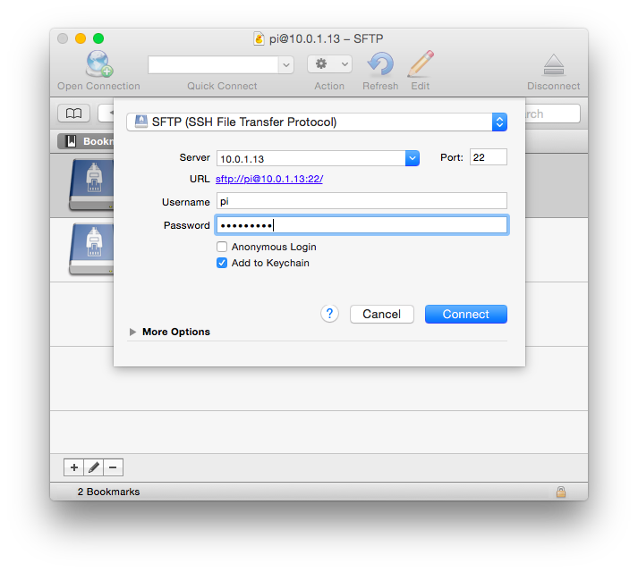
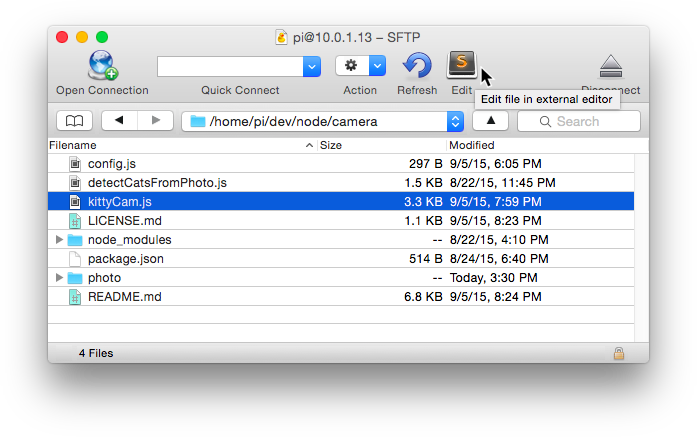

# SSH into Raspberry Pi with Cyberduck


Unix systems (Mac, Linux) come with a utility called SSH, or Secure Shell, which allows you to easily connect to another SSH-enabled machine if you have its IP address and proper credentials.

First, make sure your Pi and computer are on the same WiFi network.

If you are directly connecting your Pi to a monitor and a keyboard, open a terminal, and find the IP address:

```bash
pi@raspberrypi ~$ hostname -I
```

Once you find the IP address, open a terminal app on Mac, and ssh into the address. I am using the default username for Pi, "pi".

```bash
you@Mac ~$ ssh pi@10.0.1.13
``` 

Then type the password. Default is *raspberry*.

Once connected to your Pi, you can create files, code, and execute from the terminal. Raspbian is a Debian based, so you can use usual linux commands.

## Coding on Your Fave IDE

I usually use **Sublime Text** to code, so I prefer doing so for coding on Pi as well. Here's what I do:

First, download and install [Cyberduck](https://cyberduck.io) on your machine.

Then connect your Pi via SSH, using its IP address (See the Mac screenshot below) 



When you edit a file, open the file with "Edit". 



As you seen in the screenshot, it automatically select Sublime to edit files.