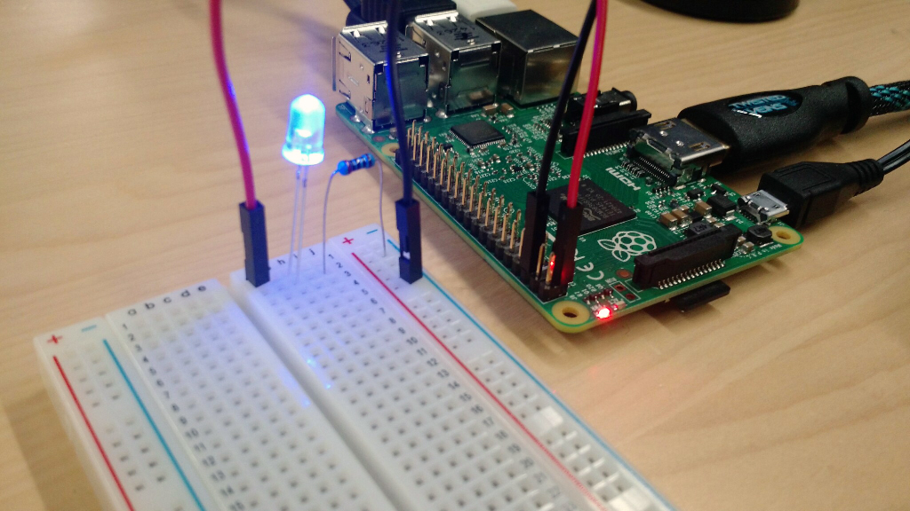

# Using LED: Hello World of Hardware

## Wiring an LED

To get started with wires and breadboard, let's make an LED light up by simply wiring to the 3.3V.

### What You Need

- Raspberry Pi 2 (Set up properly. See [Setting up Raspberry Pi](../README.md))
- 1 LED light (Somewhere around 1.9V - 3.2V, depending on the color of your choice)
- 1 Resistor 200Ω (15 - 300Ω)
- Breadboard
- 2 M-to-F jumper wires, 2 colors


### Assemble the Circuit

  1. First, designate one of the jumper wires as power, and plug it into the Pi's 3.3v pin. Plug the other into one of the Pi's GND pins. 
  
    *In the abstract, you could use one of the Pi's 5v pins to power an LED. However, the Pi's GPIO pins, which we  will use later to actually control the LED, output to 3.3v- so using the basic 3.3v pin in this step will allow you to accurately calibrate your circuit for later use.*  

    The pins aren't labeled on the Pi directly, so this diagram will prove useful for any Pi + Hardware experiment       you work on:
    

    In our case, **White** is PWR and **Brown** is GND. Here's how it looks on a Pi:
    [need image]

2. Connect your GND wire to the first row of the breadboard. On a nearby row, plug in your 3.3v power wire.
    
    We'll be building a circuit from the 3.3v pin, through the breadboard, and back to the GND pin. 

3. Connect the long pin of your LED to the same row as your power wire. Plug the short pin into the last row on a blank rail, preferably that between your power and GND rows.
     

4. With your resistor, connect one pin to the LED and the other to the GND wire's row, completing the circuit.
    

When you simply power on your Pi, your light will turn on, like so:


If you are using a 400-point breadborad, your circuit should look similar to this:


If you are using 400-point breadboard as seen in the photo below, [see this diagram](../../images/LED/fritzing-led-3v-400.png).



## Controlling the LED with Node.js using Johnny-Five

When you program the LED, re-connect the 3.3V wire into a one of GPIO pin. In this example,
I am using the GPIO-4 (Pin 7).


#### A Word About pins

Now that we've built a complete circuit using the Pi's GND and 3.3v PWR pins, it's time to make modifications and build some modest hardware control.

To make the LED programmable, we will use one of the Pi's many GPIO pins. Through code, we can designate these pins as either digital inputs or outputs. When a pin turns  from LOW (0) to HIGH (1), it supplies a 3.3v signal. This functionality is used to trigger, or respond to, sensors and actuators. 

The Raspberry Pi's pins, and those for GPIO in particular, have two designations: Pin number (the numbers inside the circles on the diagram), and a BCM (Broadcom SOC Channel) designation (the numbers in the boxes alongside the diagram). 


Here's the diagram again:


### Building the Circuit

In this case, we simply want to write code that, when executed, will blink the LED 7 times.

To change the circuit to be controllable, we simply unplug the power wire from the Pi's 3.3v pin and attach it to one of the GPIO pins, as below:
[Need image]

Referencing the diagram above, you'll see that this is GPIO-4, or Pin 7. 


If you are using 400-point breadboard, [see this diagram](../../images/LED/fritzing-led-gpio-400.png).


### Installing Johnny-Five

Intro [Johnny-Five](https://github.com/rwaldron/johnny-five) blah blah

Install the Johnny-Five module with npm:

`pi@raspberrypi ~$ npm install johnny-five`

### Installing Raspi-io

Intro
https://github.com/bryan-m-hughes/raspi-io

blah

Install raspi-io:

`pi@raspberrypi ~$ npm install raspi-io`

### Strobe.js - Lighting up LED

If you are already familiar with Johnny-Five, using it with raspi-io is pretty straightforward, although does take an extra step compared to the Arduino Uno.

```
var raspi = require('raspi-io');
var five = require('johnny-five');
var board = new five.Board({
  io: new raspi()
});

board.on('ready', function() {

  // Create an Led on pin 7 (GPIO4) on P1 and strobe it on/off
  var led = new five.Led('P1-7'));
  
  led.strobe();

});
```