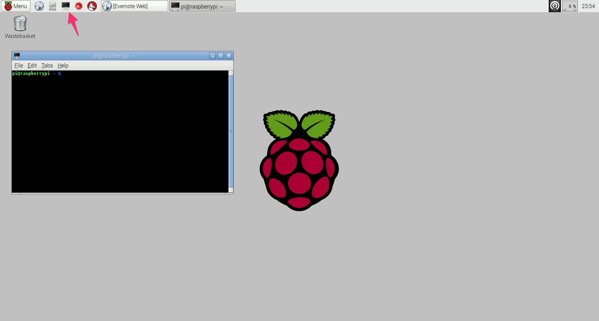

## Setting up PubNub Node.js Lib


Open LXTerminal:



Make sure your Pi is up-to-date:

```bash
pi@raspberrypi ~$ sudo apt-get update
```

then,

```bash
pi@raspberrypi ~$ sudo apt-get upgrade
```

Download Node (v0.12.6):

```bash
pi@raspberrypi ~$ wget http://node-arm.herokuapp.com/node_archive_armhf.deb
```

*Note: I am not sute if the post-merge version of node (v4+) works with Jonny-Five and Raspi-io, but if you would like to download and install the latest node, get `http://node-arm.herokuapp.com/node_latest_armhf.deb` instead.*

once downloaded, install Node:

```bash
pi@raspberrypi ~$ sudo dpkg -i node_archive_armhf.deb
```

*or `node_latest_armhf.deb` when you are installing the lasted node.*

Check if node is successfully installed:

```bash
pi@raspberrypi ~$ node -v
```

You should see the Node version number, if it is installed correctly.

Then, install PubNub:

```bash
pi@raspberrypi ~$ npm install pubnub
```


---

## "Hello World" with PubNub

Learn how to use PubNub Python APIs by publishing simple messages.

- [Publishing messages using PubNub](helloworld/)


## "Hello World" of Hardware

Learn how to assemble circuit with wires and breadboard using a LED.

- The first project: [Blinking LED](led/)

---

## Pi Projects with Sensors

Now, let's connect some sensors to Raspberry Pi, and learn more about sending and receiving data to/from the sensors using PubNub APIs!


### Using Motion Sensor

Using a IR motion sensor to detect when some object is near the sensor.

- [Sending realtime data using a motion sensor](motion-sensor/)

