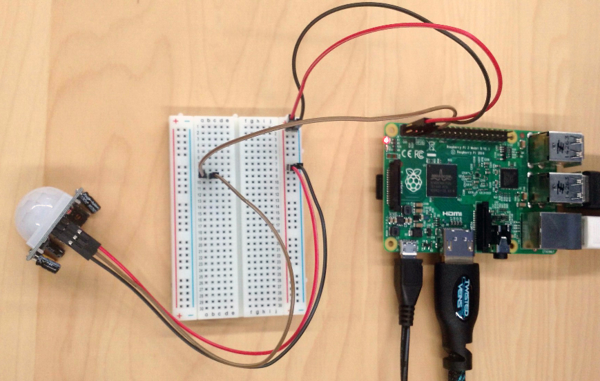
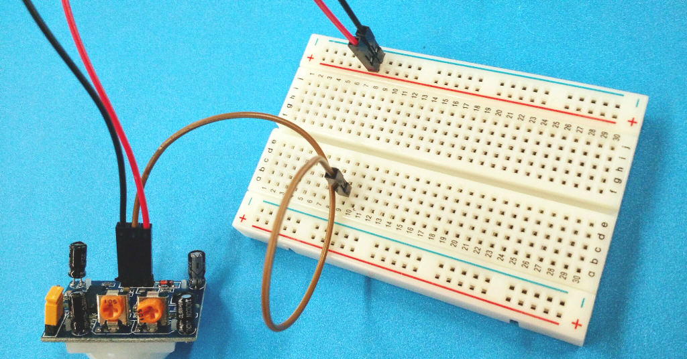
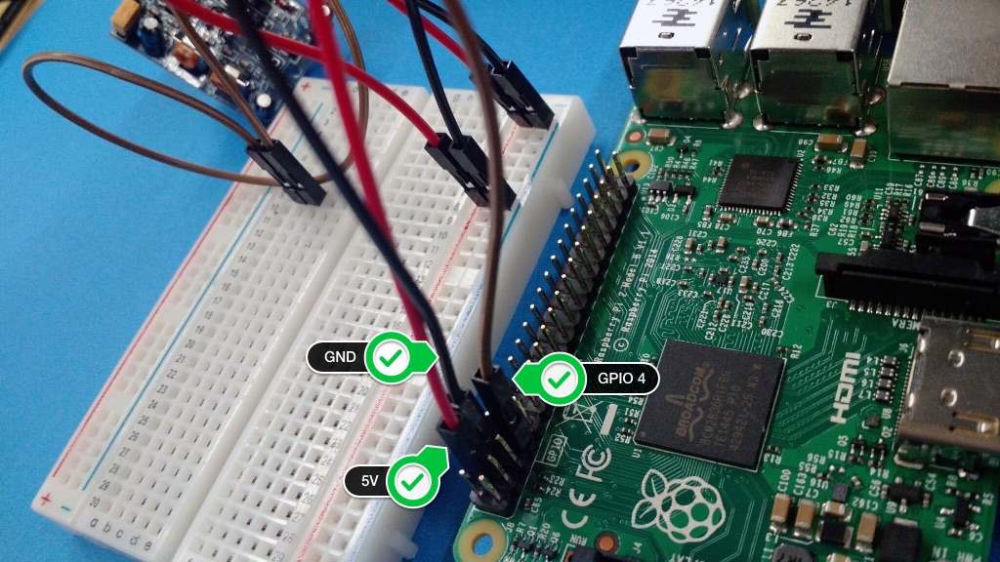

# Using a Pyroelectric IR Motion Detector

PIR sensors sense motion, and are able to detect a change in infrared radiation levels of their detection zone (e.g. when a cat enters a room).

Let's try using a PIR sensor with PubNub to send the realtime data of motions around the world!

## Wiring up PIR Sensor

### What You Need:

- Raspberry Pi 2 (Set up properly. See [Setting up Raspberry Pi](../README.md))
- [PIR sensor](https://learn.adafruit.com/pir-passive-infrared-proximity-motion-sensor/overview)
- Breadboard
- 6x M-to-F jumper wires, 3 colors with 2 of each

### Assemble the Circuit

Your PIR sensor should have 3-pin connection. 
Wire up to the sensor as following:

- Red wire to PIR-VCC (3-5VDC voltage power)
- Black wire to PIR-GND (ground power)
- Brown wire to PIR-OUT (signal out)

Note that not all sensor has thr 3-pin connection in the same order, so make sure you wire in the correct pins. The easy way to find out is that look for a power protection IC (looks red in the picture), and one pin next to it should be VCC.
 

Now, plus the other ends of the wires to a breadborad:

- Red wire (PIR-VCC) to a positive rail (in the photo below, row 7, but you can use any positive rail)
- Black wire (PIR-GND) to a negative rail, next to the red wire
- Brown wire (PIR-OUT) to any blank rail (row 7, column b, but you can pick any blank)

### Wireing up Pi

Take another pair of red, black and brown wire.

First, plug into one end to Pi:

- Red wire to GPIO 5V (Pin 4)
- Black wire to GPIO GND (Pin 6)
- Brown wire to GPIO 4 (Pin 7)

Then, plug into one end to the breadborad:

- Red wire (GPIO 5V) to a positive rail (in the photo below, raw 1, but you can use any positive rail)
- Black wire (GPIO GND) to a negative rail, next to the red wire
- Brown wire (GPIO 4) to the same rail as your PIR-OUT

If you are using a mini breadborad, your circuit should look similar to this:

If you are using 400-point breadboard as seen in the photo below, [see this diagram](../../images/PIR/fritzing-pir-400.png).

## Add-on Project: Motion Sensor with LED

If you would like to modify this project with an LED as a visual indicator, [read on](../motion-led)!

