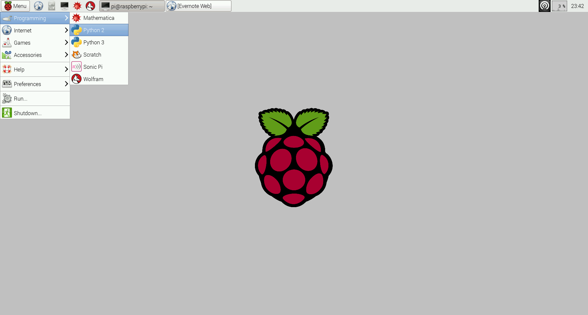

# Hello World with PubNub Python APIs

Open Python 2 IDE



Then, in Python Shell,  **File** > **New Window**

In the new window, copy and paste [hello.py](hello.py), and save as `hello.py`

Run the script

On terminal:
`$ sudo python hello.py`

This sends a Hello World message to PubNub data stream.


## Monitoring PubNub Data Stream on Console

1. On web browser, go to [http://www.pubnub.com/console/](http://www.pubnub.com/console/)
2. Type `hello` into the **Channel** field, enter your publish key into **publish key** and subscribe key at  **subscribe key**
3. Click **Subscribe**


## The Quick Code Walk-though 

Now we’ll quickly walk through using the PubNub API for Python SDK. Just follow the steps…

Include the Python SDK in your code.

```python
from Pubnub import Pubnub
```

`init()`: Get a new Pubnub instance with publish and subscribe key


```python
pubnub = Pubnub(publish_key="your-pub-key", subscribe_key="your-sub-key")
```


`publish()`: Publish a message!


```python
def callback(message):
     print(message)
 pubnub.publish('hello', 'Hello PubNub', callback=callback, error=callback)
```

Usually, you might want to send more than just a string. In Python, we do this by sending dictionaries represented by a key-value pair in the following manner. 

```python
data = {
    'username': 'Bob',
    'message': 'Hi'
}

pubnub.publish('hello-pi', data, callback=callback, error=callback)
```
 
Also, you can `subscribe` all messages that have been published to the channel. 

This block of code is not included in the `hello.py`, so try creating a new file, or add the code to your hello.py to subscribe all other messages coming to the channel, **hello**.

```python
def _callback(message, channel):
   print(message)
 
 def _error(message):
     print(message)
 
 pubnub.subscribe(channels='hello-pi', callback=_callback, error=_error)
```
 
