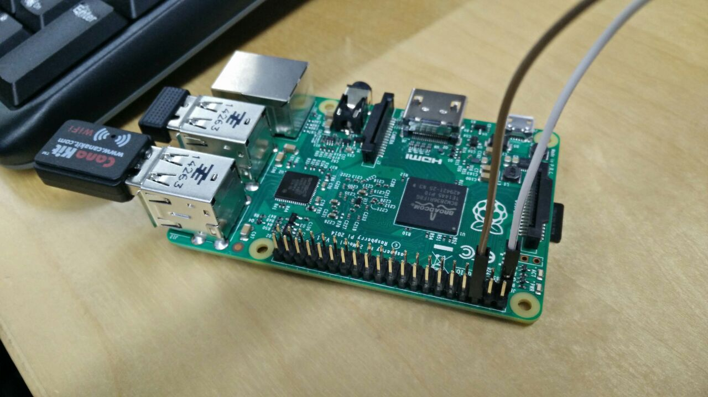
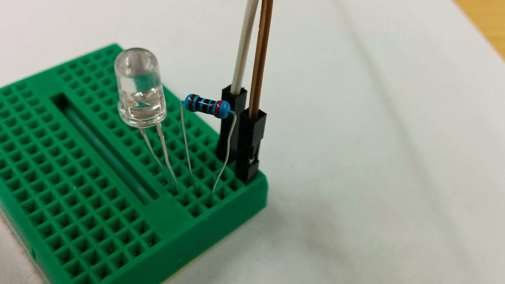
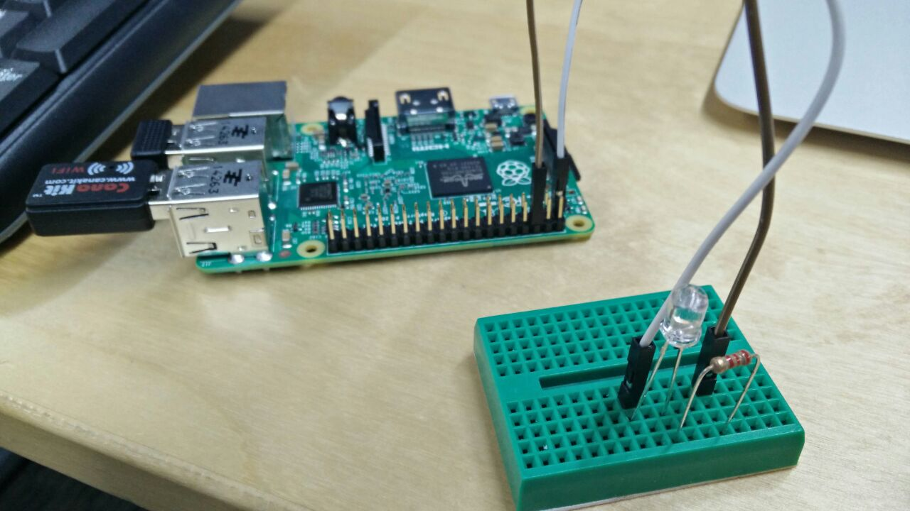
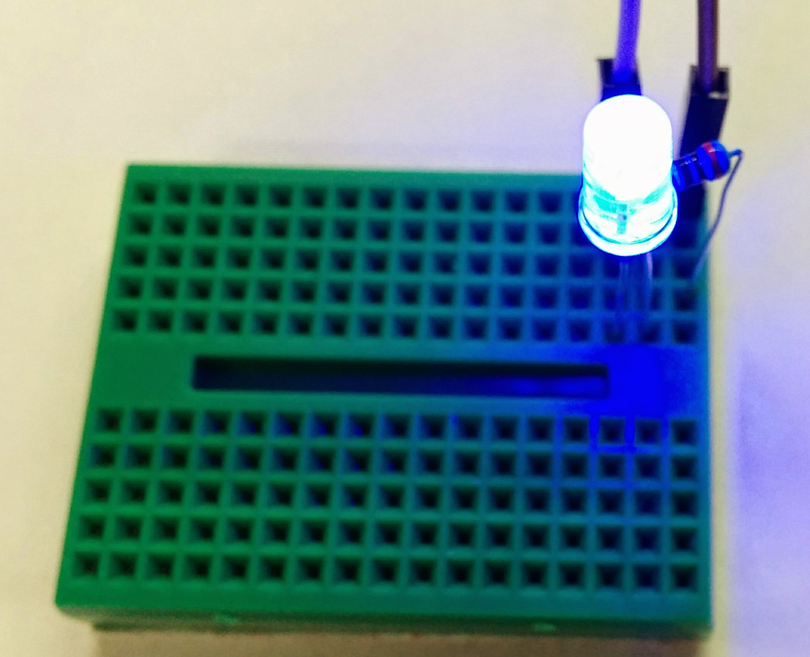
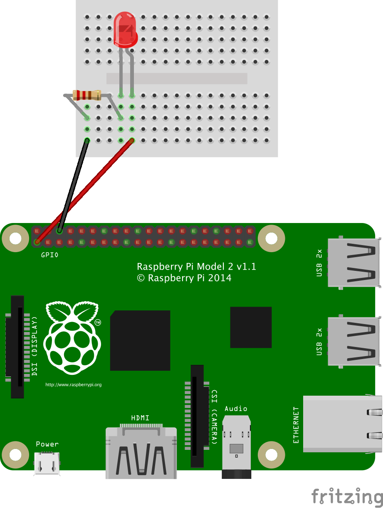
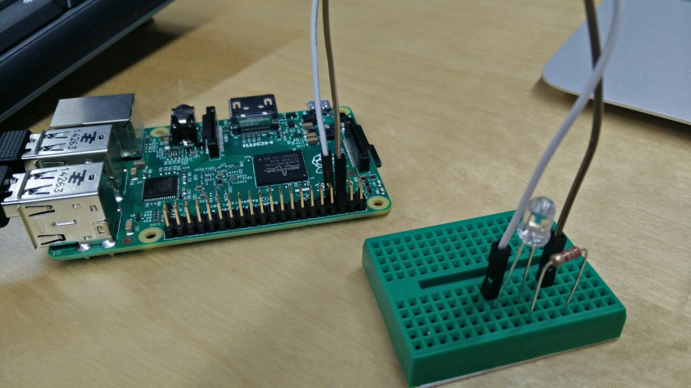
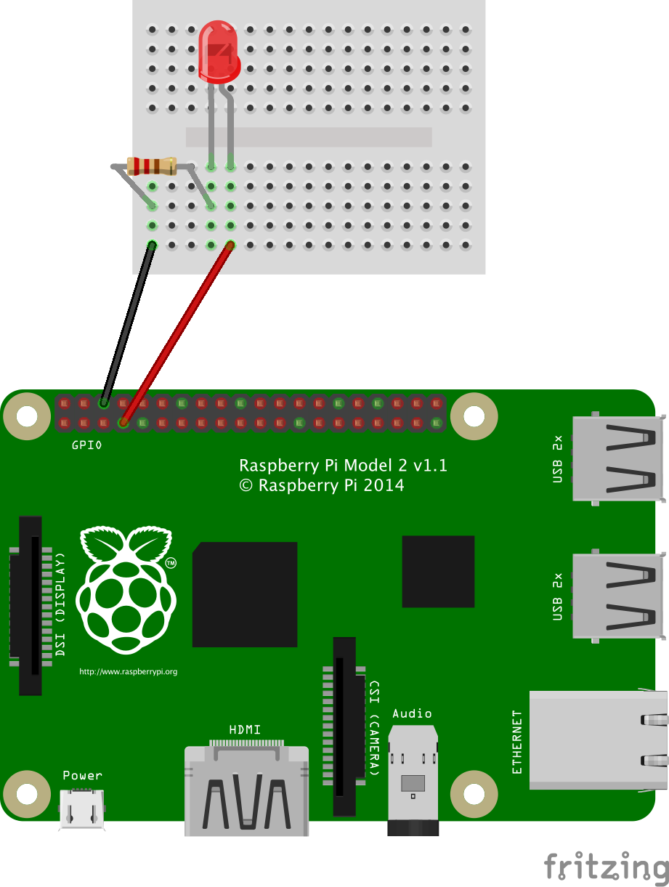

# Pi-Light LED: A "Hello World" of Hardware

## Wiring an LED

To get started with wires and a breadboard, we'll first make a simple circuit that connects a Pi's 3.3v pin to an LED, causing it to light up. 
After covering the fundamentals, we'll introduce control over hardware by modifying our circuitry and writing simple code to wirelessly turn the light on and off, over the internet.

### What You Need

- Raspberry Pi 2 (Set up properly. See [Setting up Raspberry Pi](../README.md))
- 1 LED light (Somewhere around 1.9V - 3.2V, depending on the color of your choice)
- 1 Resistor ~200Ω
- Breadboard
- 2 M-to-F jumper wires, 2 colors


### Assemble the Circuit

  1. First, designate one of the jumper wires as power, and plug it into the Pi's 3.3v pin. Plug the other into one       of the Pi's GND pins. 
  
    *In the abstract, you could use one of the Pi's 5v pins to power an LED. However, the Pi's GPIO pins, which we  will use later to actually control the LED, output to 3.3v- so using the basic 3.3v pin in this step will allow you to accurately calibrate your circuit for later use.*  

    The pins aren't labeled on the Pi directly, so this diagram will prove useful for any Pi + Hardware experiment       you work on:
    

    In our case, **White** is PWR and **Brown** is GND. Here's how it looks on a Pi:
    

2. Connect your GND wire to the first row of the breadboard. On a nearby row, plug in your 3.3v power wire.
    
    We'll be building a circuit from the 3.3v pin, through the breadboard, and back to the GND pin. 

3. Connect the long pin of your LED to the same row as your power wire. Plug the short pin into the last row on a blank rail, preferably that between your power and GND rows.
     

4. With your resistor, connect one pin to the LED and the other to the GND wire's row, completing the circuit.
    
    
5. This is how the whole cicuit looks like.  
	

When you simply power on your Pi, your light will turn on, like so:



If you are using a mini breadborad (as seen in the photos), your circuit should look similar to this:



If you are using 400-point breadboard, [see this diagram](../../images/LED/fritzing-led-3v-400.png).

## Controlling the LED with Python

#### A Word About pins
Now that we've built a complete circuit using the Pi's GND and 3.3v PWR pins, it's time to make modifications and build some modest hardware control.

To make the LED programmable, we will use one of the Pi's many GPIO pins. Through code, we can designate these pins as either digital inputs or outputs. When a pin turns  from LOW (0) to HIGH (1), it supplies a 3.3v signal. This functionality is used to trigger, or respond to, sensors and actuators. 

The Raspberry Pi's pins, and those for GPIO in particular, have two designations: Pin number (the numbers inside the circles on the diagram), and a BCM (Broadcom SOC Channel) designation (the numbers in the boxes alongside the diagram). 

When using pins in code, you have to pick a designation. Throughout the code in our workshop, we will refer to pins by their **BCM designation.** 

Here's the diagram again:


### Building the Circuit

In this case, we simply want to write code that, when executed, will blink the LED 7 times.

To change the circuit to be controllable, we simply unplug the power wire from the Pi's 3.3v pin and attach it to one of the GPIO pins, as below:


Referencing the diagram above, you'll see that this is GPIO-4, or Pin 7. 



If you are using 400-point breadboard, [see this diagram](../../images/LED/fritzing-led-gpio-400.png).

### Writing the Code

[Full Code Here](led.py)

1. First, import the libraries we'll use in the code. **RPi.GPIO** is a library of commands used to easily control the Pi's GPIO pins. **time** is a common library, used here to create delays of specific length.

```python
import RPi.GPIO as GPIO
import time
```

2. Set the pin designation type. In this case, we use BCM- the GPIO number- rather than the pin number itself.

```python
GPIO.setmode (GPIO.BCM)
```
3. So that you don't need to manage non-descriptive numbers, set "LIGHT" to 4 so that our code can easily reference the correct pin.

```python
LIGHT = 4
```

4. Because GPIO pins can act as either digital inputs or outputs, we need to designate a pin as one or the other. This allows functions in the GPIO library to easily recognize and use a given pin, all in order to properly send and receive signals.

    In this case, we want to use the Pi to switch the pin from LOW to HIGH, outputting a signal. So, we set the pin LIGHT to be an output.

```python
GPIO.setup(LIGHT,GPIO.OUT)
```

5. Out actual function will be rather simple: cause the light to blink till you quit the program and print a message each time.
To blink the light, we call GPIO.output and pass as parameters the pin number (LIGHT) and the state we want.
"True" sets the pin to HIGH (sending a signal), while "False" sets it to LOW. 

To achieve a blink, we set the pin to High, wait for a second, then set it to Low.

```python
while True:
    GPIO.output(LIGHT,True)
    time.sleep(1)
    GPIO.output(LIGHT,False)
    time.sleep(1)
    print("Hello World")
```


To run the code, save it as a file with an intuitive name, like "lightblink.py." 
In the Pi's command line, type:

    sudo python lightblink.py

You should soon see your light blink and your messages print.  

### Next Project

Let's make this into Internet of Things!
Next, you are making this [LED a remote controllable](../remote-led/).
