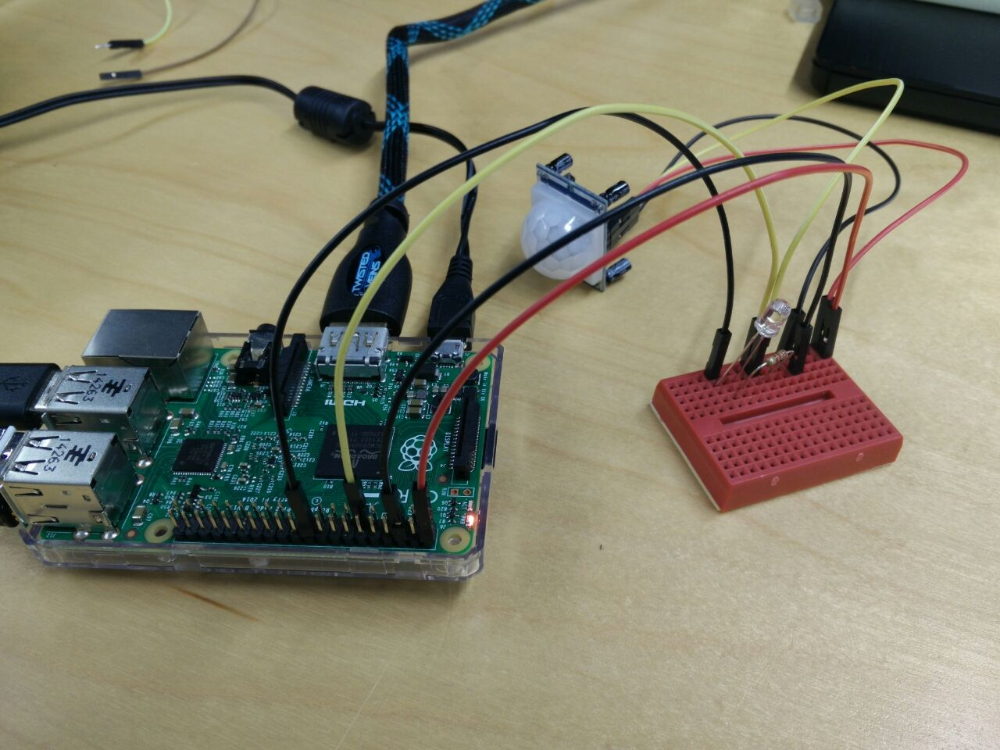
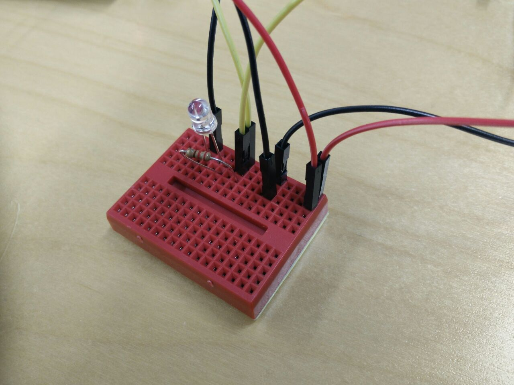
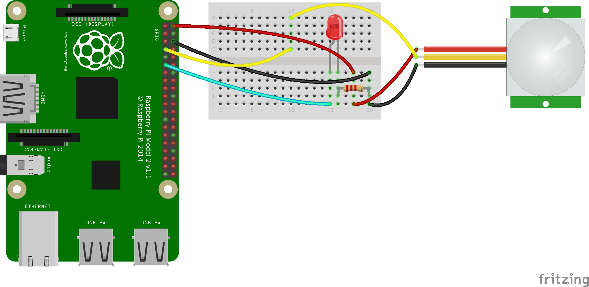

# Motion sensor with a visual indicator

Here we will modify the circuit from the [motion sensor](../motion-sensor/motionsensor.py) to add an LED that will only light up when motion is detected. 

## Hardware




Wire up the circuit in the following manner. The LED will blink for 30 seconds or so when the Raspberry Pi is powering on. Wait for it to settle, and run the program as explained below. You will notice how everytime motion is detected, the LED turns on and when there is nothing in front of the motion sensor, it turns off. At the same time motion is detected, a message is published to PubNub as well. 

### What you need 


- Raspberry Pi 2 (Set up properly. See [Setting up Raspberry Pi](../README.md))
- [PIR sensor](https://learn.adafruit.com/pir-passive-infrared-proximity-motion-sensor/overview)
- Breadboard
- 220 ohm resistor
- LED
- 5x M-to-F jumper wires, 2 red, 2 black and 2 of any color(we have yellow) of your choice.

### Wiring up PIR Sensor

Your PIR sensor should have 3-pin connection. 
Wire up to the sensor as following:

- Red wire to PIR-VCC (3-5VDC voltage power)
- Black wire to PIR-GND (ground power)
- yellow wire to PIR-OUT (signal out)

Now, plug the other ends of the wires to a breadborad:

- Red wire (PIR-VCC) to any point on the bread board
- Black wire (PIR-GND) to any other point on the board, as long as its not on the same rail as the red wire.
- yellow wire (PIR-OUT) to any blank rail 

### Wiring up Pi

Take another pair of red, black and yellow wire.

First, plug into one end to Pi:

- Red wire to GPIO 5V (Pin 2)
- Black wire to GPIO GND (Pin 6)
- yellow wire to GPIO 17 (Pin 11)
- second black wire from the LED to GPIO GND (pin 20)

### Wiring up the breadboard

- Red wire (GPIO 5V) to any point on the same rail as the red wire from the sensor.
- Black wire (GPIO GND) to any point on the same rail as the black wire from the sensor.
- connect one end of the 220 ohm resistor to the same rail as the yellow wire from the sensor. The other end can sit on any other rail. 
- The positive end of the LED(anode) to the other end of the resistor, and the cathode to any other rail.
- From the same rail as the yellow wire from the sensor, insert another yellow wire that sits on pin 11 from the Pi.




If you are using a mini breadborad, your circuit should look similar to this:





## Running the program

Open Python 2 IDE

Then, in Python Shell,  **File** > **New Window**

In the new window, copy and paste [motion-led.py](https://github.com/pubnub/workshop-raspberrypi/blob/master/projects-python/motion-led/motion-led.py), and save as `motion-led.py`

Run the script

On terminal:
`$ sudo python motion-led.py`

This will run the program to detect motion and switch on an LED when motion is detected.

### Monitoring PubNub Data Stream on Console

1. On web browser, go to [http://www.pubnub.com/console/](http://www.pubnub.com/console/)
2. Type `motionsensor-led` into the **Channel** field, `demo` into both **publish key** and **subscribe key**
3. Click **Subscribe**


## What is happening behind the scenes

This project builds on the existing Motion sensor project, by adding the LED element. When motion is detected, not only a message is sent to PubNub, but also a message to the LED to light up. 

### The code 


We want to switch on the LED when motion is detected, but switch off when there is nothing moving. For this we need to monitor the pin receiving the output from the sensor, and see if its **RISING**. GPIO.RISING lets you detect this change. The hardware circuit associated with the Pi and the LED will ensure that it switches on only motion is detected, but not otherwise.

`GPIO.add_event_detect(PIR_PIN, GPIO.RISING, callback=MOTION)`

Once in the callback function, we actually check if it RISING in which case we switch on the LED. And if its FALLING, we switch it off. 

```python
def MOTION(PIR_PIN):
    if PIR_PIN:
        print 'Motion Detected!'
        print 'Light on'
        pubnub.publish(channel, message, callback=callback, error=callback)
```