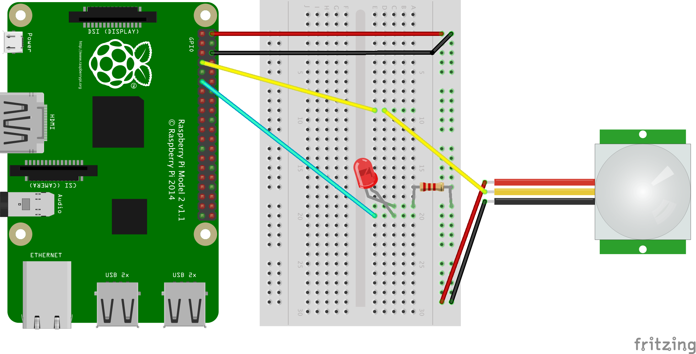

# Adding an LED to the Motion Detector

This project is an add-on for the [PIR Motion detector project](README.md)).
The LED is used as a visual indicator of the motion sensor: when a motion is detected, the LED turns on.

## Wiring up PIR Sensor and LED

### What You Need:

- Raspberry Pi 2 (Set up properly. See [Setting up Raspberry Pi](../README.md))
- [PIR sensor](https://learn.adafruit.com/pir-passive-infrared-proximity-motion-sensor/overview)
- LED (1.9 - 3.2V)
- Resistor (~200Ω)
- Breadboard
- 6x M-to-F jumper wires, 3 colors with 2 of each


### Assemble the Circuit

Addition to the circuit you have wired a PIR sensor, you connect a LED output to another GPIO (We are using GPIO-17 / Pin 11 for the diagram and the code) with an appropriate resistor. We are using 200Ω to be safe. (also, we have a lot of them for everybody!)

400-pin:

 
 
 Mini circuit TBD


## Running the program

1. Open Python 2 IDE

2. Then, in Python Shell,  **File** > **New Window**

3. In the new window, copy and paste [motion-led.py](https://github.com/pubnub/workshop-raspberrypi/blob/master/projects-python/motion-led/motion-led.py), and save as `motion-led.py`

4. Run the script

On terminal:
`$ sudo python motion-led.py`

This will run the program to detect motion and switch on an LED when motion is detected.

### Monitoring PubNub Data Stream on Console

1. On web browser, go to [http://www.pubnub.com/console/](http://www.pubnub.com/console/)
2. Type `motionsensor` into the **Channel** field, `demo` into both **publish key** and **subscribe key**
3. Click **Subscribe**


## What is happening behind the scenes

This project builds on the existing Motion sensor project, by adding the LED element. When motion is detected, not only a message is sent to PubNub, but also a message to the LED to light up. 

### The code 


We want to switch on the LED when motion is detected, but switch off when there is nothing moving. For this we need to monitor the pin receiving the output from the sensor, and see if its **RISING** or **FALLING**. GPIO.BOTH lets you detect edges in either changing direction(rising or falling). 

`GPIO.add_event_detect(PIR_PIN, GPIO.BOTH, callback=MOTION)`

Once in the callback function, we actually check if it RISING in which case we switch on the LED. And if its FALLING, we switch it off. 

```python
def MOTION(PIR_PIN):
    if PIR_PIN:
        print 'Motion Detected!'
        print 'Light on'
        GPIO.output(LED_PIN, True)
        pubnub.publish(channel, message, callback=callback, error=callback)
    else:
        print 'No Motion!'
        GPIO.output(LED_PIN, False)
```