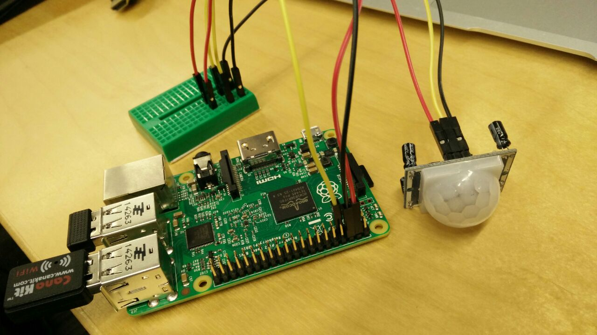
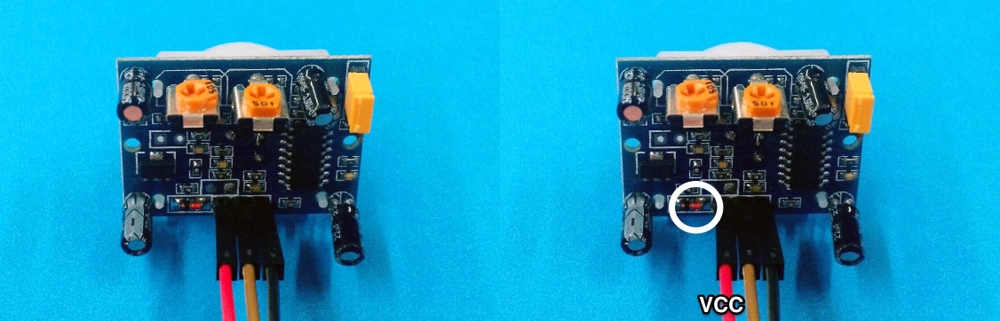
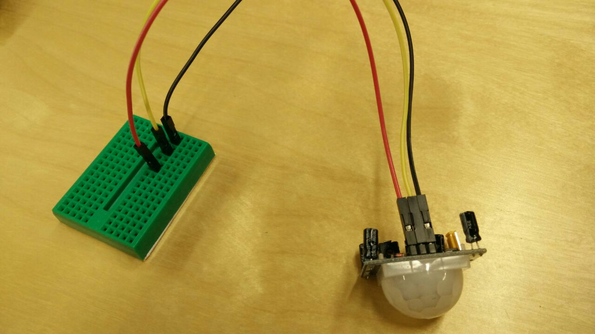
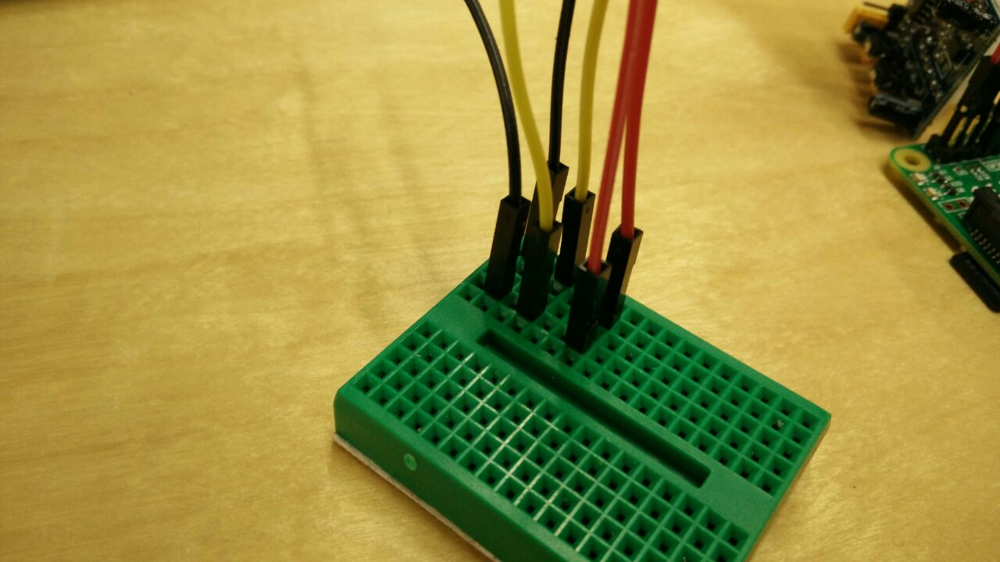
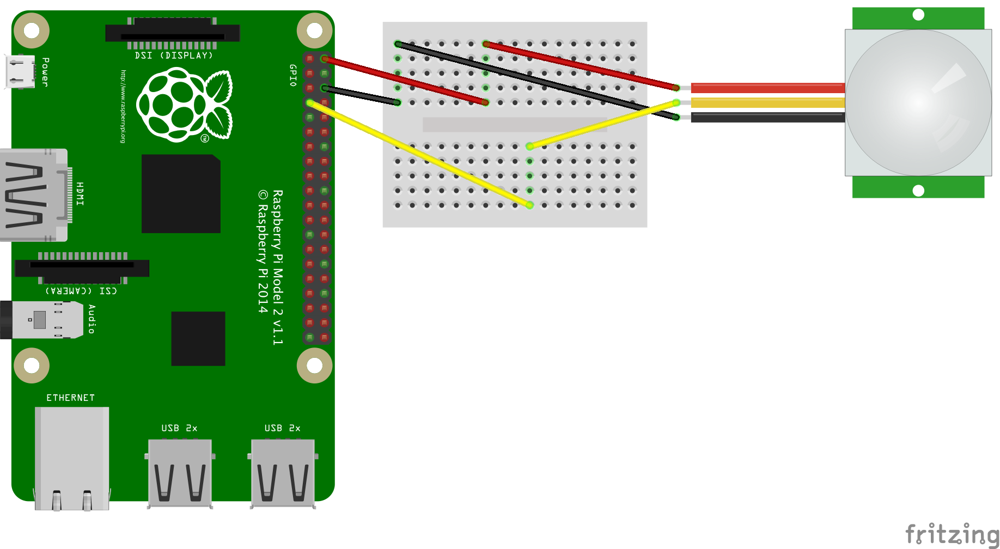
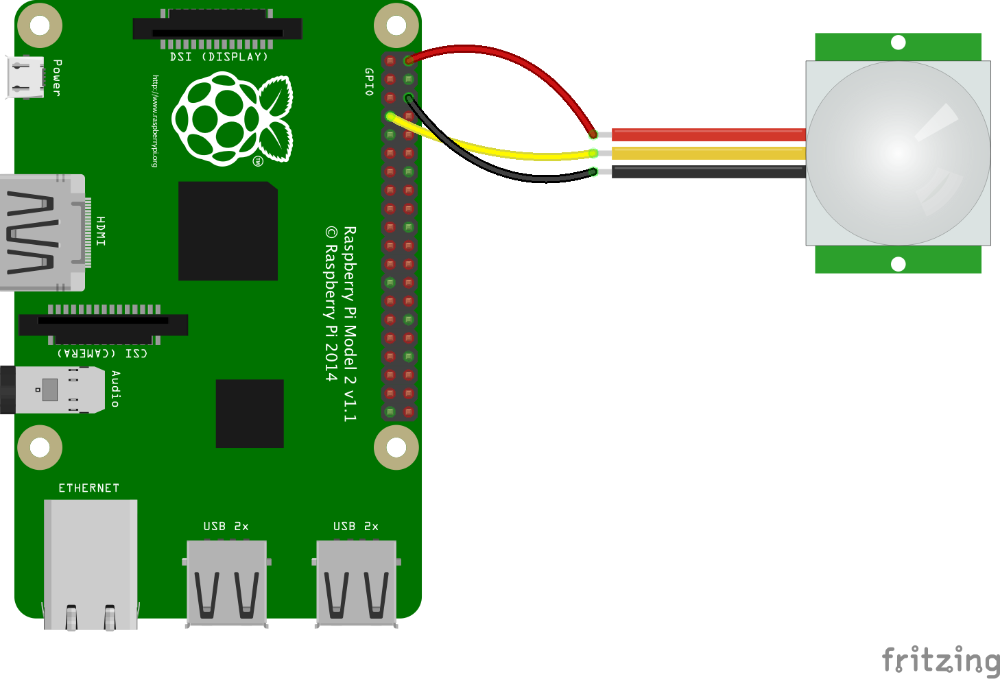

# Motion Sensor with Raspberry Pi and PubNub


The PIR sensor measures the IR radiation emitted by objects. The sensor is able to measure changes in the IR signature around it (when an object moves) and hence detect motion. This message can be sent to any device in the world using PubNub. With PubNub, all you need to do is to **publish** on a channel to the PubNub network, which can be **subscribed** to by any other device any where else in the world.

##How to run this program

In case you want to jump to the exciting part and run the program, then just follow the below steps. 

1. Open Python 2 IDE

2. Then, in Python Shell,  **File** > **New Window**

3. In the new window, copy and paste [motionsensor.py](../motion-sensor/motionsensor.py), and save as `motionsensor.py`

4. Run the script

On terminal:
`$ sudo python motionsensor.py`

This sends a message to PubNub data stream when motion is detected.


# Description of the project

## Using a Pyroelectric IR Motion Detector





## Step 1 : The hardware

### What You Need:

- Raspberry Pi 2 (Set up properly. See [Setting up Raspberry Pi](../README.md))
- [PIR sensor](https://learn.adafruit.com/pir-passive-infrared-proximity-motion-sensor/overview)
- Breadboard
- 6x M-to-F jumper wires, 3 colors (red, black, and yellow in this doc) with 2 of each


### Wiring up PIR Sensor

Your PIR sensor should have 3-pin connection. 
Wire up to the sensor as following:

- Red wire to PIR-VCC (3-5VDC voltage power)
- Black wire to PIR-GND (ground power)
- Yellow wire to PIR-OUT (signal out)

Note that not all sensor has the 3-pin connection in the same order, so make sure you wire in the correct pins. The easy way to find out is that look for a power protection IC (looks red in the picture), and one pin next to it should be VCC.
 


Now, plug the other ends of the wires to a breadborad:

You can plug them anywhere, as long as they aren't on the same rail. 



### Wiring up Pi

Take another set of red, black and yellow wire.

First, plug into one end to Pi:

- Red wire to GPIO 5V (Pin 4)
- Black wire to GPIO GND (Pin 6)
- Yellow wire to GPIO 4 (Pin 7)


Then, plug into one end to the breadborad:

- Red wire (GPIO 5V) on the same rail as the red wire from the sensor.
- Black wire (GPIO GND) to the same rail as the black wire from the sensor.
- Yellow wire (GPIO 4) to the same rail as your PIR-OUT

 

When you are using M/F wires with a breadborad, your circuit should look similar to this:



If you have female/female wires, you can directly wire them up without a breadboard:




## Step 2 : The software


The motion sensor is designed to send a web based alarm, when it detects motion. To do this, the overall setup has to detect motion and then publish a message using PubNub.

### Breaking up the code

#### Line by line explanation of what the code does:

**Accesing the code from other modules. The following modules are used in the code:**

 - **GPIO** to access the GPIO (general purpose input output)pins on the Raspberry Pi. This library lets handles the interfacing with the pins.
 - **sys** module provides access to some variables used or maintained by the interpreter and to functions that interact strongly with the interpreter. It is always available.
 - **Pubnub** allows you to access the PubNub APIs to publish the messages over the internet.
 
 ```python
import RPi.GPIO as GPIO
import sys
from Pubnub import Pubnub
```

**Setting up the keys for Pubnub**

Every one who signs up for [PubNub](https://www.pubnub.com/get-started/), gets a unique set of keys. This way, you can choose the devices that can send and receive messages from your device. 

Once you have a PubNub account, replace the string 'demo' in Publish_key and subscribe_key, with your own keys. If not, you can use 'demo,' but common use of this key may result in throttled message speeds.


```python
publish_key = 'demo'
subscribe_key = 'demo'
secret_key = 'demo'
cipher_key = ''
ssl_on = False
```

**Initiate Pubnub State**

 - In order to use the PubNub APIs, it is necessary to create a PubNub object using the keys we got above. 
 - The channel variable can be named whatever you like. Your Pub key, sub key, and channel name will all be used to transmit and keep track of the data from your Pi.
 - The message argument can contain any JSON serializable data, including: Objects, Arrays, Ints and Strings. Message data should not contain special python classes or functions as these will not serialize. String content can include any single-byte or multi-byte UTF-8 character.

```python
pubnub = Pubnub(publish_key=publish_key, subscribe_key=subscribe_key, secret_key=secret_key, cipher_key=cipher_key, ssl_on=ssl_on)
channel = 'motionsensor'
message = {'Motion': 1}
```

**Setting up variables for the pins on Pi**

The sensor module communicates with the Pi by sending electrical signals to specific pins. When receiving no signal, a pin is read as LOW. When a signal is recieved, that pin switches to HIGH. This binary operation is at the heart of any digital I/O device, including LEDs and stepper motors. For now, we'll deal with it in its simplest form.

First, we have to point our code to the pins we're using. To do so, add the following to your code:

```python
GPIO.setmode(GPIO.BCM)
```
The GPIO.BCM option means that you are referring to the pins by the "Broadcom SOC channel" number, rather than to the pin number. The BCM numbers are those after the "GPIO" in the board overview diagram: 


In our code, we have set up pin 7 (GPIO 4) to be the input pin receiving the sensor information.  

```python
PIR_PIN = 7
GPIO.setup(PIR_PIN, GPIO.IN)
```

**The logic that determines when the sensor has sensed motion**

The event_detected() function is designed to be used in a loop with other things, and it wont miss the change in state of an input while the CPU is busy working on other things. 

The GPIO library has built in a rising-edge function. A rising-edge is defined by the time the pin changes from low to high, but it only detects the change.

We want the Pi to publish a message when motion is detected. This is done by adding the callback function. 

```python
try:
  GPIO.add_event_detect(PIR_PIN, GPIO.RISING, callback=motion)
  while 1:
    time.sleep(100)
except KeyboardInterrupt:
  print “ Quit”
```

**Asynchronous usage of Pubnub publish API**

The callback function, MOTION, calls pubnub.publish which sends the message over the channel, and also prints the message that is sent so you can see this on your screen as well. 

```python
def callback(message):
  print(message)
def motion(PIR_PIN):
  pubnub.publish(channel, message, callback=callback, error=callback)
```

**Some print statements when the code is run, just to enhance the user experience**

```python
print “PIR Module Test (CTRL+C to exit)”
time.sleep(2)
print “Ready”
```

**Exiting your program cleanly**

RPi.GPIO provides a built-in function GPIO.cleanup() to clean up all the ports you’ve used. It only affects any ports you have set in the current program. It resets any ports you have used in this program back to input mode. 

```python
GPIO.cleanup()
```


## Add-on Project: Motion Sensor with LED

If you would like to modify this project with an LED as a visual indicator, [read on](../motion-led)!

