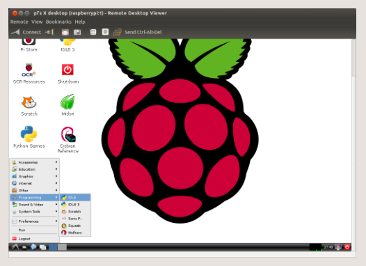
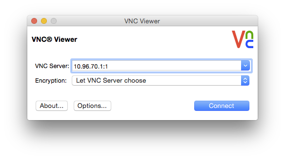
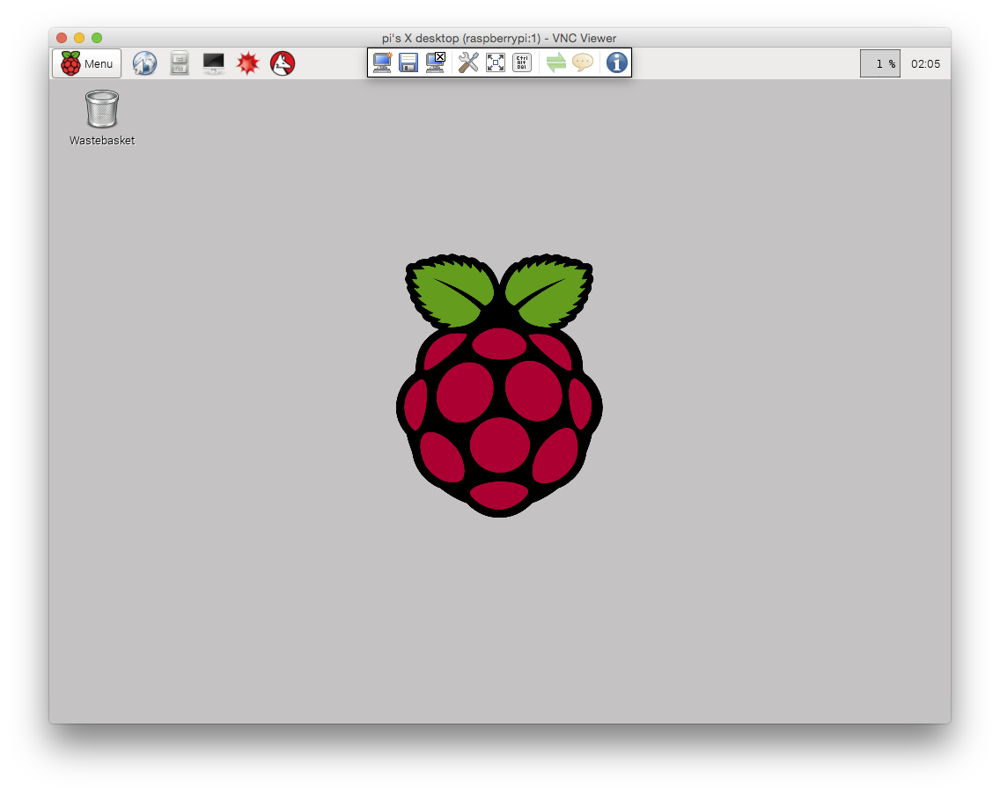

# Remote Access using VNC

Remote access to the Pi's graphical interface, viewed in a window on another computer.

Make sure that your Pi is running (power cable is attached), and Wi-Fi is connected. You can disconnect a monitor, keyboard, and mouse.

## VNC Server on Raspberry Pi

On your computer, SSH to your Pi:

`you@Mac $ ssh 10.96.70.1 -l pi` // use your Pi's IP address

(Or you can operate the followings directly on Pi.)

Install the TightVNC package

`pi@raspberrypi ~ $ sudo apt-get install tightvncserver`

Run TightVNC Server

`pi@raspberrypi ~ $ tightvncserver`

This will prompt you to enter a password and an optional view-only password.

## VNC Client on Computer

### Linux

1. Linux distributions usually have a remote desktop viewer already installed. This can be found under the **Applications / Internet menu**.

2. Enter the Pi's IP address, followed by the screen number `:1`. Then click **Connect**.

3. Click the Connect button and you will be prompted for the password that was specified when configuring the VNC server on the Raspberry Pi earlier. 

4. You will now see the Raspberry Pi desktop.

### Mac OS

1. Download [VNC Client](http://www.realvnc.com/download/vnc/latest) and install.

2. Enter the Pi's IP address, followed by the screen number `:1`. Then click **Connect**.

3. At the Unencrypted Connection prompt, click **Continue**

4. Now you should get the Rapberry Pi desktop!

### Windows

1. On Windows you'll need to download and install a VNC client program. A commonly used one is TightVNC which can be downloaded from tightvnc.com.

2. Choose either the 32 or 64 bit download depending on which version of Windows you are using.

3. During installation you'll be offered the choice of Typical, Custom or Complete. Choose **Custom**. Then select **TightVNC Server** and choose **Entire feature will be unavailable**. Click Next. Uncheck the option about Windows Firewall and click Next again, then Install.

4. Once installed, find TightVNC Viewer in the Start menu. Enter the Pi's IP address followed by `:1`.

5. Click the Connect button and you will be prompted for the password that was specified when configuring the VNC server on the Raspberry Pi earlier. 

6. You will now see the Raspberry Pi desktop.

### Reference

[VNC (Virtual Network Computing)](http://www.raspberrypi.org/documentation/remote-access/vnc/README.md) by RaspberryPi.org 
